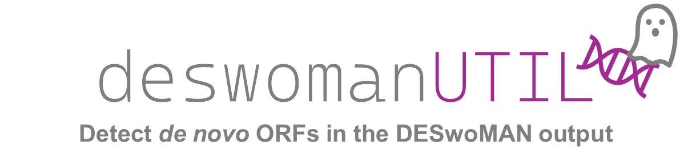

# deswomanUTIL
Some helper scripts to work with the DESwoMAN output.

> [!IMPORTANT]
> This script has not been extensively tested so use at your own risk and double check the results. 


## How to use:
**Step1:**  Clone this repository:
``https://github.com/MarieLebh/deswomanUTIL.git``

**Step 2:**  Install [Blast](https://blast.ncbi.nlm.nih.gov/Blast.cgi) and/or [OrthoFinder](https://github.com/davidemms/OrthoFinder). For more details check the respective documentation. They need to be directly callable from the command line so you might have to add them to PATH.

**Step 3:**  Install [Biopython (version 1.85)](https://biopython.org/wiki/Download):
``pip install biopython``

**Step 4:**  Make sure you have all required files ready to use. If you are not sure how to do it, check out the [Test dataset](https://github.com/MarieLebh/deswomanUTIL/tree/main/Test) and structure your own data accordingly.

That's it! Now you can use the individual scripts and work with your deswoman output. :smile:


## 1) filterDESwoMAN.py

> [!IMPORTANT]
> This script allows to select which mutations would be considered "enabling" and thus the absence of which features would deem a homolog noncoding. Per default the presence of one of these mutations would deem the homolog "noncoding":
> - Absence of a canonical start codon (ATG)
> - Absence of a stop codon (TAA, TAG, TGA)
> - Absence of complete transcription. That means not the complete homolog is transcribed. It can however be partly transcribed. There might also be antisense transcription.
> - A premature stop codon in the first x % of the sequence (the x corresponds to the threshold selected during the preceeding DESwoMAN run).
> - Less than 50 % of the reading frame is conserved in the homolog.
>
> If none of these features are missing the homolog will be considered "potentially coding" and the script requires a noncoding homolog in a more distant outgroup. Otherwise the ORF is excluded as its _de novo_ status could not be confirmed.

> [!IMPORTANT]
> [Blast](https://blast.ncbi.nlm.nih.gov/Blast.cgi) needs to be installed and callable from the commandline if you want to blast against a TE or RNA database.

Filter the output of [DESwoMAN](https://github.com/AnnaGrBio/DESWOMAN) to get a dataset of high confidence _de novo_ originated neORFs.
It is important that you did the following steps before running:
1) You ran DESwoMAN on one or multiple species. The output for each species needs to be in a separate folder with the full name (e.g. DmelZI or DsubFAL). This is also true when you only ran it for one species!
2) You have a newick tree with all species (in- and outgroups) in your analysis (even if you also have populations this tree needs to contain 4 letter species ids). It is important that all internal nodes are named. Also no polytonies are allowed as this will lead to errors!
3) Your samples have a four letter species id optionally followed by a sample id (if applicable) e.g. Dmel (for _Drosophila melanogaster_) or Hsap (for _Homo sapiens_).

- `--accepted_mutations` Comma separated list of all mutations you want to count as noncoding (all possibilities are: start, stop, prematurestop and transcription (complete, partial and/or antisense))
- `--frameshift_score` Maximum percent of frame conservation above which it will be considered coding
- `--deswoman` Path to the DESwoMAN folder. Its necessary that you run DESwoMAN for all species.
- `--ortho` Path to an Orthogroup file ("Orthogroups.txt", str) generated with Orthofinder and including the filename
- `--out` Name of the output folder to store the filtered data
- `--rna_check` Blast against an rna database (e.g. cdna/ncrna) (default = false)
- `--species_file` Text file with all samples listed (one per line, str)
- `--te_check` Blast against an TE database  (default = false)
- `--te_db` Path to a fasta TE database of your organism (str)
- `--te_cov` Blast coverage for TE search (float, default = 80)
- `--te_idt` Percent identity for TE search (float, default = 80)
- `--te_eval` Evalue for TE search (float, default = 0.001)
- `--tr_db`  Path to a transcript database (e.g. cdna/ncrna, str)
- `--tr_cov` Blast coverage for transcript search (float, default = 80)
- `--tr_idt` Percent identity for transcript search (float, default = 80)
- `--tr_eval` Evalue for transcript search (float, default = 0.001)
- `--tr_strand` Strand for the transcript search (string, default = "plus")
- `--tree` Newick tree of all samples analyzed (needs internal node ids, str)

__Usage:__
```filterDESwoMAN.py [-h] [--te_db TE_DB] [--te_cov TE_COV] [--te_idt TE_IDT] [--te_eval TE_EVAL] [--ortho ORTHO] [--deswoman DESWOMAN] [--rna_check][--te_check] [--tr_db TR_DB] [--tr_cov TR_COV] [--tr_idt TR_IDT] [--tr_eval TR_EVAL] [--tr_strand TR_STRAND] [--out OUT][--tree TREE] [--species_file SPECIES_FILE] [--accepted_mutations ACCEPTED_MUTATIONS] [--frameshift_score FRAMESHIFT_SCORE]```


## 2) getGFFfromOut.py
Generate a gff file with all neORF candidates from the DESwoMAN info file. 

- `--deswoman` Path to the deswoman information file
- `--gtf` Path to the corresponding transcriptome assembly (gtf)
- `--outname` Name of the output file (default: DESwoMAN)

__Usage:__
```python3 getGFFfromOut.py [-h] --deswoman PATH/TO/DESWOMAN/info_file.txt --gtf Path/To/GTF --outname Path/To/OUTNAME```

## 3) runOrthofinder.py

> [!IMPORTANT]
> [OrthoFinder](https://github.com/davidemms/OrthoFinder) needs to be installed and callable from the commandline if you want to blast against a TE or RNA database.

Prepares your input for [OrthoFinder](https://github.com/davidemms/OrthoFinder) and then runs it with a given number of threads.

- `--create_folder` Only create the orthofinder input files/folder and exit. Do not run Orthofinder.
- `--deswoman` Path to the deswoman folder (NOT: info file!)
- `--species_file` File with the name of all querys for which to do this analysis. Important: Each need to have a folder with the query name and DESwoMAN output in the working directory. 
- `--threads` Number of threads for the Orthofinder run. 

__Usage:__
```runOrthfinder.py [-h] [--threads THREADS] [--create_folder] [--species_file SPECIES_FILE] [--deswoman DESWOMAN]```

## 4) removeCodingfromFile3.py
Remove noncoding homologs that have an expressed homolog via [OrthoFinder](https://github.com/davidemms/OrthoFinder).

- `--deswoman` Path to the deswoman folder (NOT: info file!)
- `--ortho` Path to the orthofinder ["orthogropus.txt" file](https://github.com/davidemms/OrthoFinder?tab=readme-ov-file#orthogroups-directory-deprecated) (Needs to be this format!)
- `--species_file` File with the name of all querys for which to do this analysis. Important: Each need to have a folder with the query name and DESwoMAN output in the working directory. 

__Usage:__
```removeCodingfromFile3.py [-h] [--ortho ORTHO] [--deswoman DESWOMAN] [--query_file QUERY_FILE]```


## 5) checkTEcontent.py

> [!IMPORTANT]
> [Blast](https://blast.ncbi.nlm.nih.gov/Blast.cgi) needs to be installed and callable from the commandline if you want to blast against a TE or RNA database.

Get a fast overview of the neORFs TE content using a TE library

- `--cov` Blast coverage for TE search (float, default = 80)
- `--evalue` Evalue for TE search (float, default = 0.01)
- `--NeORF` Path to the neORF fasta file (nucleotide)
- `--perc_ident` Percent identity for TE search (float, default = 80)
- `--TE_db` Path to the TE database (fasta file)

__Usage:__
```checkTEcontent.py [-h] [--NeORF NEORF] [--TE_db TE_DB] [--evalue EVALUE] [--perc_ident PERC_IDENT] [--cov COV]```

## 6) denovoDataComparator.py

> [!IMPORTANT]
> [Blast](https://blast.ncbi.nlm.nih.gov/Blast.cgi) needs to be installed and callable from the commandline if you want to blast against a TE or RNA database.

Do a simple nucleotide or protein blast between two de novo gene datasets (e.g. your DESwoMAN output vs. a published set) to see how many have a hit.
- `--cov` Blast coverage for search (float, default = 80)
- `--evalue` Evalue for search (float, default = 0.01)
- `--NeORF` Path to the neORF fasta file (nucleotide)
- `--perc_ident` Percent identity for blast search (float, default = 80)
- `--denovo_db` Path to the de novo gene database (fasta file, nucleotides or amino acids)

__Usage:__
```checkTEcontent.py [-h] [--NeORF NEORF] [--TE_db TE_DB] [--evalue EVALUE] [--perc_ident PERC_IDENT] [--cov COV]```